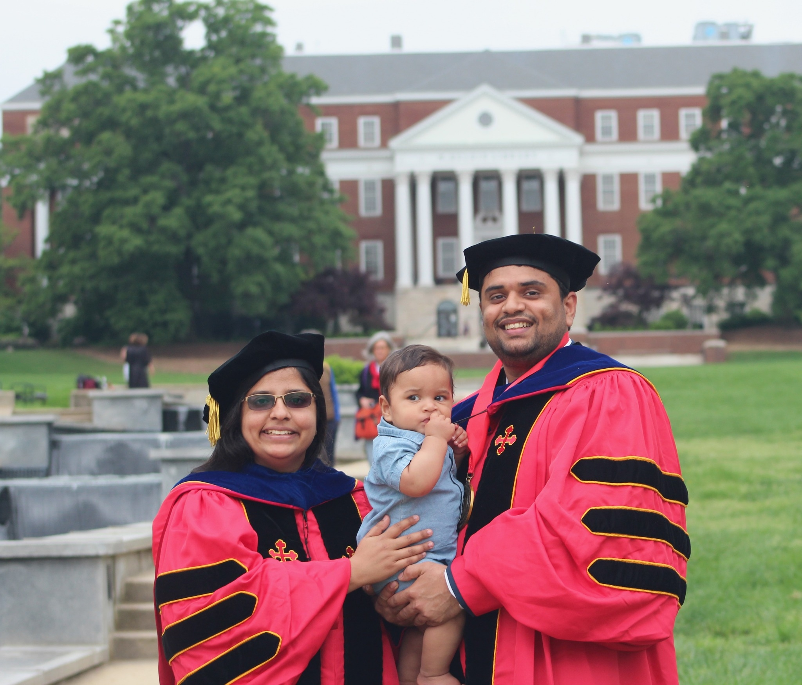
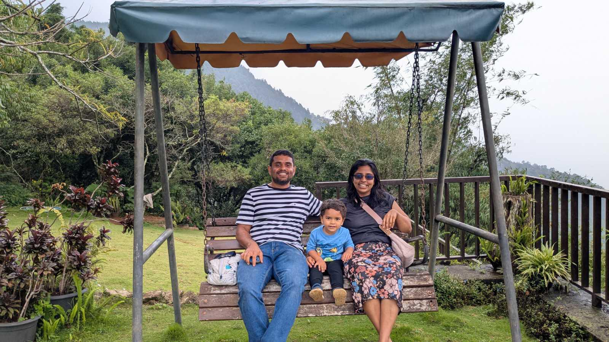
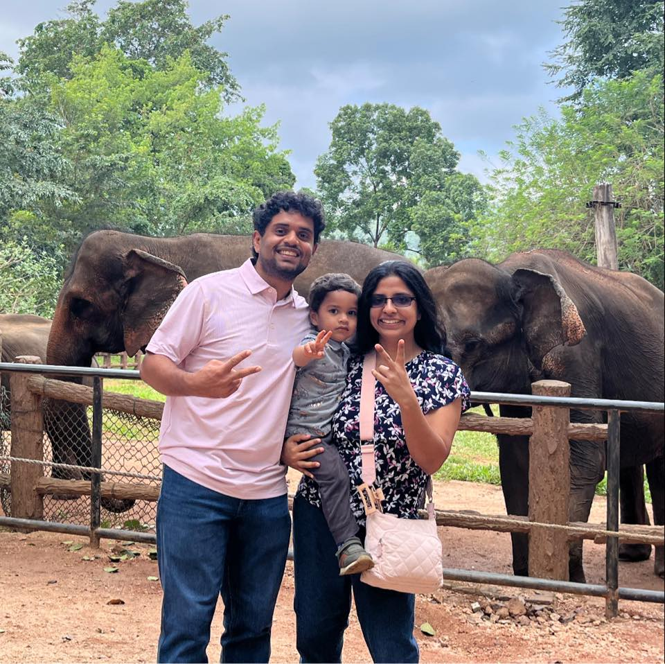
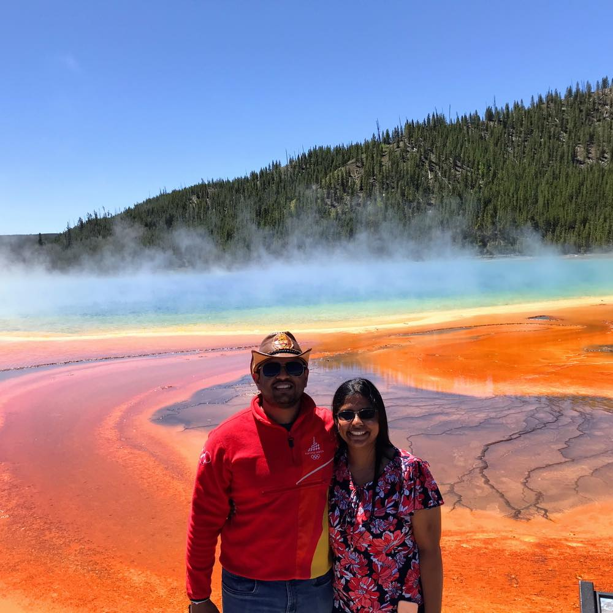
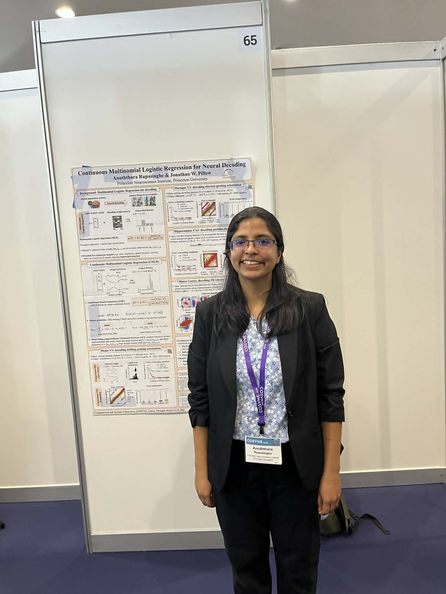

Outside of work, I enjoy spending time with my family, traveling and exploring new places, baking, and reading books. I also enjoy presenting my research at conferences and connecting with researchers from different fields.

  
  
  
  
  
  
  
  

