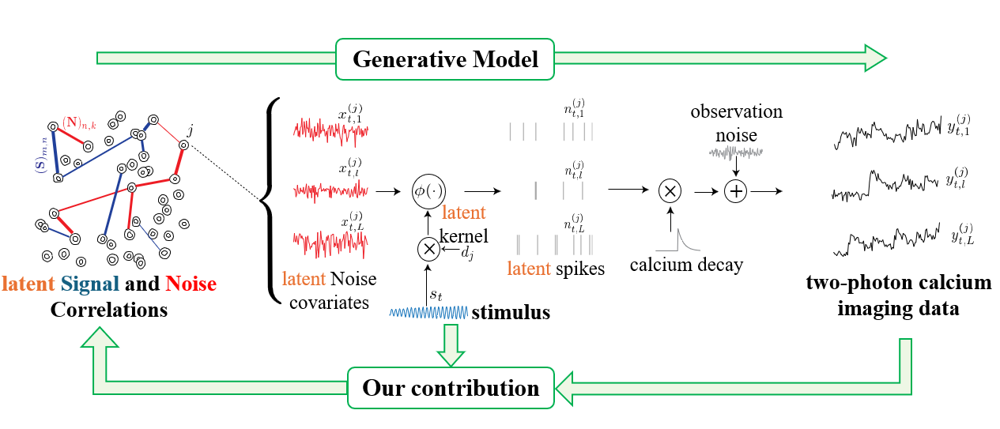
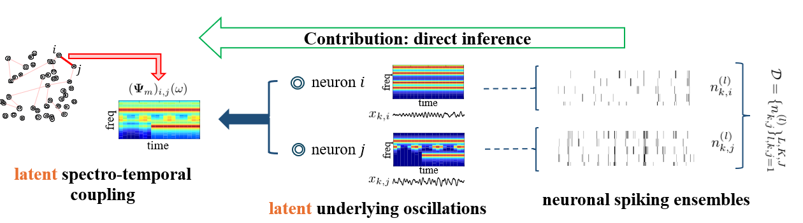
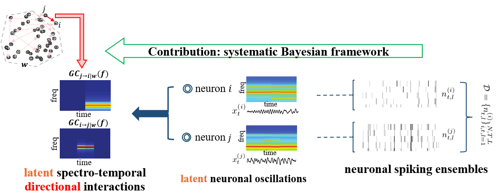
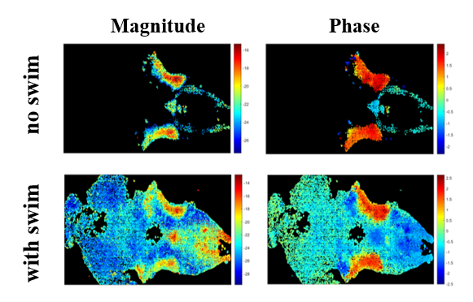
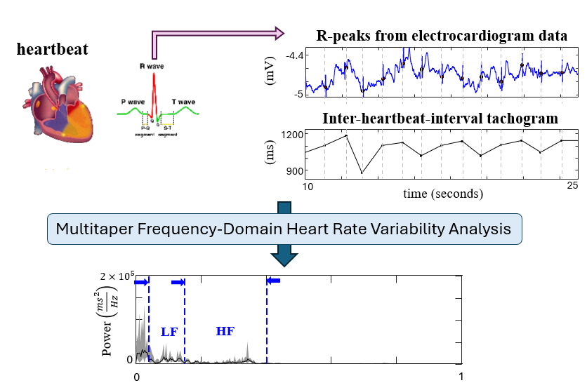
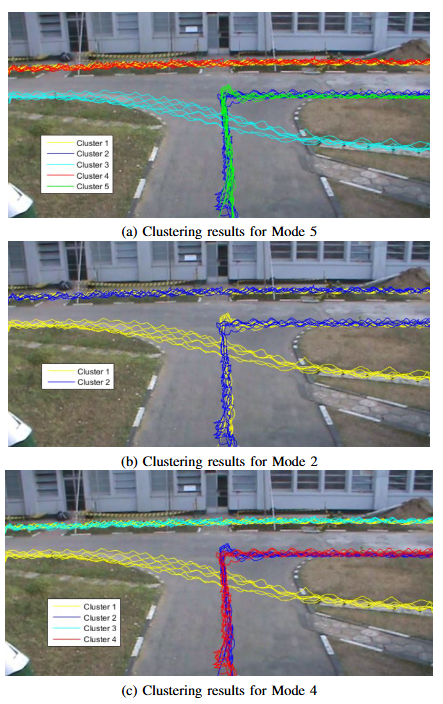

My projects develop probabilistic machine learning, Bayesian inference, and statistical signal processing methods for analyzing neural, physiological, and behavioral data. These projects span neural decoding, spike-train modeling, Bayesian inference, spectral analysis, causal inference, physiological time-series analysis, and computer vision.

::: {.project-block}

::: {.project-image}

:::

::: {.project-text}

## Continuous Multinomial Logistic Regression

- **Published in:** International Conference on Learning Representations (**ICLR 2026**)  
- **Code:** [Python (PyTorch)](https://github.com/Anuththara-Rupasinghe/CMLR)  
- **Keywords:** Conditional density estimation, Gaussian processes, variational inference, uncertainty calibration, neural decoding, logistic regression, circular variables

I developed **Continuous Multinomial Logistic Regression (CMLR)**, a probabilistic framework for decoding continuous variables such as orientation, position, velocity, and head direction from neural population activity. CMLR generalizes multinomial logistic regression to continuous output spaces and estimates a full probability density over decoded variables rather than only a point estimate.

The model uses smooth, interpretable neuron-specific weight functions regularized by Gaussian process priors, allowing it to capture multimodal, asymmetric, and circular conditional distributions. I developed scalable Fourier-domain stochastic variational inference methods and evaluated CMLR on datasets from visual cortex, hippocampus, and motor cortex, where it produced well-calibrated posterior densities and outperformed DNNs, XGBoost, FlexCode, and Naive Bayes decoders.

:::

:::
---

::: {.project-block}

::: {.project-image}

:::

::: {.project-text}

## Continuous partitioning of neuronal variability

- **Published in:** [eLife, 2026](https://elifesciences.org/reviewed-preprints/109719)  
- **Code:** [MATLAB](https://github.com/Anuththara-Rupasinghe/CMP)  
- **Keywords:** Spike trains, neural coding, Gaussian processes, overdispersion, variational inference

I developed the **Continuous Modulated Poisson (CMP)** model, a continuous-time framework for partitioning neuronal variability in overdispersed spike trains into stimulus-driven activity and stimulus-independent modulatory gain fluctuations. CMP models a neuron’s instantaneous firing rate as the product of a time-varying stimulus drive and a stochastic gain process, both represented as exponentiated Gaussian processes.

I introduced the **Exponentiated Power Law (EPL)** kernel to capture slowly decaying gain correlations and analytically link latent variability to Fano factor behavior across bin sizes. I also developed a scalable frequency-domain variational inference procedure for fitting the model efficiently. Applied to spike responses from LGN, V1, V2, and MT, CMP captured variability across timescales and revealed that modulatory gain fluctuations become larger and slower in higher visual areas.

:::

:::
---

::: {.project-block}

::: {.project-image}

:::

::: {.project-text}

## Direct Extraction of Signal and Noise Correlations from Two-Photon Calcium Imaging

- **Published in:** [eLife, 2021](https://elifesciences.org/articles/68046)  
- **Follow-up application:** [PNAS, 2025](https://www.pnas.org/doi/abs/10.1073/pnas.2510012122)  
- **Code:** [MATLAB](https://github.com/Anuththara-Rupasinghe/Signal-Noise-Correlation)  
- **Keywords:** Two-photon calcium imaging, signal correlations, noise correlations, Bayesian inference, variational inference, state-space modeling

I developed a Bayesian framework for directly estimating signal and noise correlations from two-photon calcium imaging data without requiring an intermediate spike-deconvolution step. This work was done in collaboration with the **Kanold Lab at Johns Hopkins University**. The method addresses the challenge that fluorescence traces are noisy and temporally blurred observations of underlying spiking activity, which can bias conventional correlation estimates.

The model combines point-process modeling, state-space methods, Pólya-Gamma augmentation, and variational inference to relate latent spiking activity and correlation structure directly to observed fluorescence traces. This provides an efficient approach for jointly estimating signal and noise correlations while accounting for calcium dynamics, observation noise, stimulus effects, and latent variability. Applied to simulated data and real recordings from mouse auditory cortex, the method recovered reliable correlation structure across spontaneous and stimulus-driven conditions and revealed distinct spatial trends in signal and noise correlations across cortical layers.
:::

:::
---

::: {.project-block}

::: {.project-image}

:::

::: {.project-text}

## Multitaper Analysis of Semi-Stationary Spectra from Multivariate Neuronal Spiking Observations

- **Published in:** [IEEE Transactions on Signal Processing, 2020](https://ieeexplore.ieee.org/abstract/document/9143473) 
- **Code:** [MATLAB](https://github.com/Anuththara-Rupasinghe/PPMT-ESD-Estimation) 
- **Keywords:** Neuronal spiking data, multitaper spectral analysis, semi-stationary spectra, state-space modeling, generalized linear models, Bayesian inference

I developed a statistical framework for estimating time-varying spectral structure directly from multivariate neuronal spiking observations. The method addresses limitations of existing approaches that either rely on time-domain smoothing before spectral analysis or are restricted to univariate spike trains.

The framework models spiking activity using generalized linear models and estimates semi-stationary spectral density matrices within a multitaper and state-space modeling framework. This allows spectral dynamics and cross-spectral coupling between neurons to be inferred directly from spike-train data with improved spectrotemporal resolution. I validated the method using simulations and experimentally recorded neural data, including rat cortical recordings during sleep and human spike/LFP recordings during general anesthesia. The results showed that the method can recover meaningful spectrotemporal dynamics from neuronal spiking activity and provides theoretical bias-variance guarantees.
:::

:::
---

::: {.project-block}

::: {.project-image}

:::

::: {.project-text}

## Adaptive Frequency-Domain Granger Causal Inference from Neuronal Ensemble Data

- **Published in:** [Proceedings of the 54th Asilomar Conference on Signals, Systems, and Computers, 2020](https://ieeexplore.ieee.org/abstract/document/9443471)  
- **Follow-up work:** [Asilomar 2022](https://ieeexplore.ieee.org/abstract/document/10051886)  
- **Keywords:** Granger causality, frequency-domain inference, neuronal ensembles, point-process modeling, state-space estimation, multitaper spectral analysis

I developed an adaptive frequency-domain Granger causal inference framework for estimating directed functional interactions from multivariate neuronal spiking observations. The method combines point-process modeling, state-space estimation, and multitaper spectral analysis to infer how directed interactions between neurons vary across time and frequency.

The framework builds on frequency-domain Granger causality and includes statistical tests for assessing the significance of inferred functional links. I validated the method using simulated and real neuronal ensemble data, demonstrating its utility for characterizing dynamic directed connectivity in neural populations.

:::

:::
---

::: {.project-block}

::: {.project-image}

:::

::: {.project-text}

## Investigating and Modeling Larval Zebrafish Respiration-Locomotion Coordination

- **Published in:** [Ph.D. dissertation chapter](https://www.proquest.com/openview/c29519c551dd1327f995ce48b48856c9/1?pq-origsite=gscholar&cbl=18750&diss=y) 
- **Preprint:** [bioRxiv, 2026](https://www.biorxiv.org/content/10.64898/2026.04.10.717666v1)  
- **Code:** [Python](https://github.com/Anuththara-Rupasinghe/zebrafish-respiratory-swim-coupling)  
- **Keywords:** Larval zebrafish, whole-brain light-sheet imaging, respiration, locomotion, spectrotemporal analysis, neural circuit modeling

I investigated the neural mechanisms underlying respiration-locomotion coordination in larval zebrafish in collaboration with the **Ahrens Lab at Janelia Research Campus, HHMI**. This project used whole-brain light-sheet microscopy imaging, simultaneously recorded electrophysiological data, optogenetic stimulation, and two-photon ablation experiments to identify brain regions synchronized with respiratory rhythm and understand how swimming behavior is coordinated with breathing.

I applied multitaper spectrotemporal analysis and cross-spectral phase analysis to identify respiratory neurons and categorize them based on their phase relative to the breathing rhythm. The analyses showed that swimming is phase-locked to breathing and gated by respiratory rhythm, revealing a structured coupling between locomotor and respiratory behaviors. To interpret the underlying circuit mechanisms, I also developed a spiking neural circuit model using Izhikevich neurons that reproduced the observed swimming-respiration coupling.

:::

:::
---

::: {.project-block}

::: {.project-image}

:::

::: {.project-text}

## Denoised Multitaper Frequency-Domain Heart Rate Variability Analysis

- **Published in:** [Ph.D. dissertation chapter](https://www.proquest.com/openview/c29519c551dd1327f995ce48b48856c9/1?pq-origsite=gscholar&cbl=18750&diss=y) 
- **Code:** [Python](https://github.com/Anuththara-Rupasinghe/HRV_freq_domain_analysis) 
- **Keywords:** Heart rate variability, ECG, spectral analysis, multitaper methods, Bayesian inference, physiological time series

I developed a denoised multitaper frequency-domain framework for analyzing heart rate variability from short-term ECG recordings. The method estimates interpretable HRV spectral components, including low-frequency and high-frequency power, which are commonly used to assess autonomic nervous system activity.

The framework extends classical multitaper spectral analysis using a Bayesian formulation that explicitly accounts for measurement noise and additive artifacts. I developed an expectation-maximization procedure for estimating denoised spectra and confidence bounds, and applied the method to 5-minute single-lead ECG recordings in collaboration with **Professor Nicholas Schiff’s lab at Weill Cornell Medicine**.

:::

:::
---

::: {.project-block}

::: {.project-image}

:::

::: {.project-text}

## Modes of Clustering for Motion Pattern Analysis in Video Surveillance

- **Published in:** [Proceedings of the 8th IEEE International Conference on Information and Automation for Sustainability (ICIIS), 2016](https://ieeexplore.ieee.org/document/7946550)  
- **Follow-up work:** [ICIIS 2017](https://ieeexplore.ieee.org/abstract/document/8300401)   
- **Keywords:** Video surveillance, motion pattern analysis, spectral clustering, trajectory analysis, affinity matrix, computer vision

I developed a motion pattern analysis framework for video surveillance data based on trajectory extraction, affinity construction, and normalized spectral clustering. The project addressed the challenge of identifying meaningful movement patterns in video streams while accounting for the fact that real-world motion patterns can be interpreted at multiple levels of detail.

The work introduced the concept of **Modes of Clustering**, where multiple valid clustering arrangements can exist for the same scene depending on the level of zoom or granularity. I also developed a **Sigma Sweep** approach for detecting significant clustering modes by varying the scale parameter in spectral clustering. This framework provides a more detailed representation of motion patterns that better reflects human perception and was validated through a video surveillance case study.
:::

:::
---